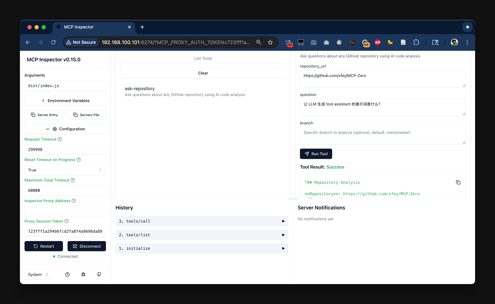

# MCP Server Testing Guide

This guide walks you through testing the Git Ask MCP Server using MCP Inspector, a visual debugging tool for Model Context Protocol servers.

## Prerequisites

- Node.js installed
- Git Ask Service running on `http://192.168.100.101:8080`
- MCP project built (`npm run build`)

## Step-by-Step Testing Instructions

### 1. Start MCP Inspector

Run the following command to launch MCP Inspector with the required configuration:

```bash
DANGEROUSLY_OMIT_AUTH=true HOST=0.0.0.0 SERVER_PORT=6277 ALLOWED_ORIGINS=http://192.168.100.101:6274 \
npx @modelcontextprotocol/inspector \
  --config inspector.config.json \
  --server my-stdio-server
```

**Environment Variables Explained:**
- `DANGEROUSLY_OMIT_AUTH=true`: Disables authentication for testing
- `HOST=0.0.0.0`: Allows external access to the inspector
- `SERVER_PORT=6277`: Proxy server port
- `ALLOWED_ORIGINS`: CORS configuration for web UI access

### 2. Access MCP Inspector Web UI

Open your web browser and navigate to:
```
http://192.168.100.101:6274/
```

You should see the MCP Inspector interface with connection status and configuration options.

### 3. Configure Request Timeout

**Important**: The default timeout (10 seconds) is too short for AI analysis tasks.

1. Click on the **Configuration** tab in the inspector
2. Locate the **Request Timeout** setting
3. Change the timeout value to `300000` (300 seconds = 5 minutes)
4. This ensures the MCP Inspector won't timeout during long-running AI operations

### 4. Connect to MCP Server

1. Click the **Connect** button
2. Wait for the connection status to show "Connected"
3. You should see server information and available resources

### 5. List Available Tools

1. Click on **List Tools** in the navigation
2. You should see the `ask-repository` tool listed
3. The tool should display its description and required parameters

### 6. Test the ask-repository Tool

1. Select the **ask-repository** tool from the tools list
2. Fill in the required parameters:
   - **repository_url**: Enter a GitHub repository URL (e.g., `https://github.com/octocat/Hello-World`)
   - **question**: Enter your question about the repository (e.g., "What is the main purpose of this repository?")
3. Click **Run Tool**



### 7. Monitor Results

The tool execution will:
1. Show progress indicators
2. Display logs from the MCP Server
3. Show the final response from the Git Ask Service
4. Include timing information and any errors

## Expected Behavior

**Successful execution should show:**
- Connection established
- Tool parameters validated
- Repository cloned and analyzed
- AI-generated response based on the codebase
- Execution time (typically 10-60 seconds depending on repository size)

**Common issues and solutions:**
- **Request timeout**: Increase timeout in Configuration
- **Connection failed**: Check if Git Ask Service is running
- **Tool not found**: Verify MCP Server built successfully
- **Invalid parameters**: Check repository URL format

## Troubleshooting

### MCP Inspector Connection Issues
```bash
# Check if MCP Inspector is running
ps aux | grep "modelcontextprotocol/inspector"

# Check if ports are available
netstat -tlnp | grep :6274
netstat -tlnp | grep :6277
```

### Backend Service Issues
```bash
# Test Git Ask Service directly
curl -s http://192.168.100.101:8080/health

# Test API endpoint
curl -X POST http://192.168.100.101:8080/api/v1/ask \
  -H "Content-Type: application/json" \
  -d '{"repository_url": "https://github.com/octocat/Hello-World", "question": "What is this repository about?"}'
```

### MCP Server Issues
```bash
# Rebuild MCP Server
npm run build

# Test server configuration
node dist/index.js --help
```

## Configuration Files

The test setup uses these configuration files:

- `inspector.config.json`: MCP Inspector server configuration
- `package.json`: MCP Server dependencies and scripts
- `tsconfig.json`: TypeScript compilation settings

## Performance Notes

- **Repository size**: Larger repositories take longer to analyze
- **Network latency**: Remote repositories require download time
- **AI processing**: Gemini API calls typically take 5-30 seconds
- **Memory usage**: Large repositories may require more memory

## Next Steps

After successful testing:
1. Configure Claude Desktop to use the MCP Server
2. Publish the package to NPM for distribution
3. Set up production deployment with proper authentication
4. Monitor performance and error rates in production

---

For more information about MCP development, visit the [Model Context Protocol documentation](https://modelcontextprotocol.io/). 